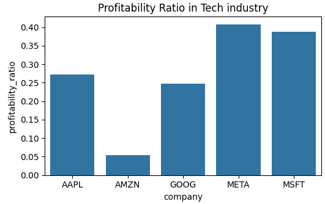
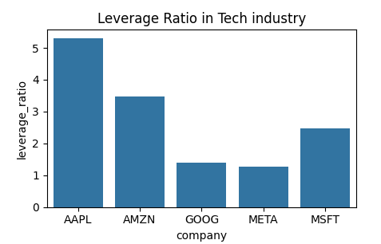

# 📊 Visualizations

### 1. Revenue Over Time by Sector

Shows the trend in operating revenue across Real Estate, Technology, and Consumer Goods.

---

### 2. Profitability vs. Leverage Ratio

Scatter plot to explore correlation between profitability and leverage.

---

### 3. Correlation Matrix

Analyzes relationships between growth margin, profitability, debt, and liquidity.

---

### 4. Profitability of Top Tech Companies

Comparison of Apple, Amazon, Google, Meta, Microsoft.

---

### 5. Leverage Capacity of Top Tech Companies

Shows debt-to-equity ratio across leading tech companies.

