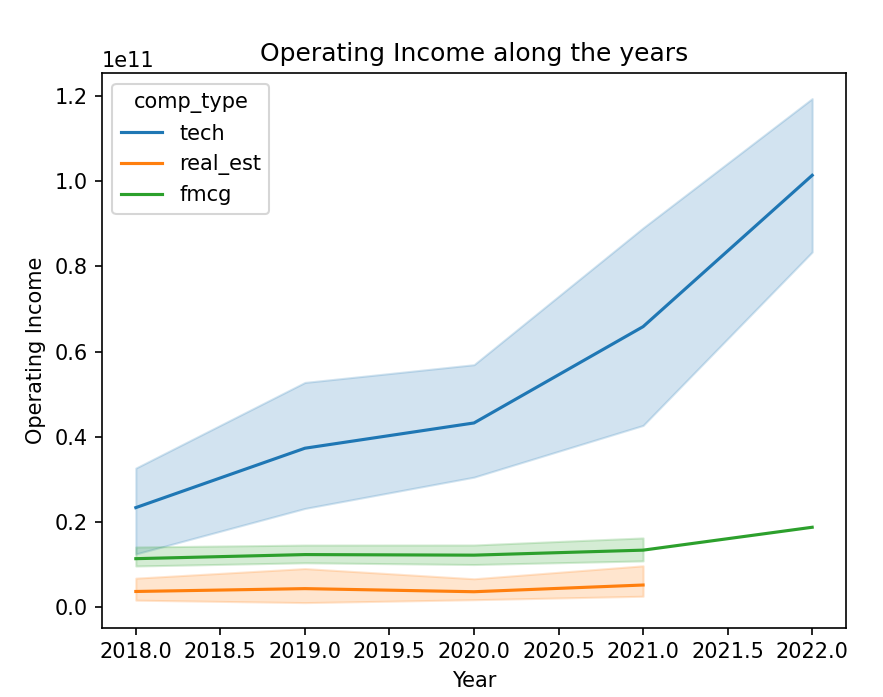
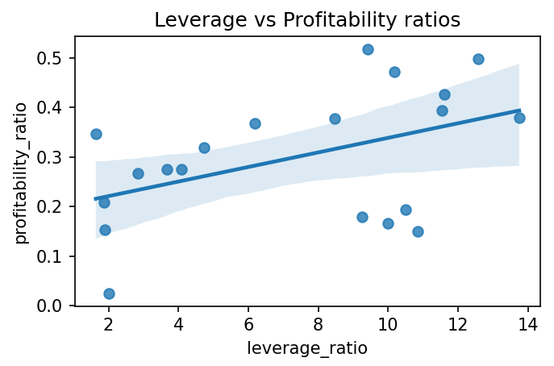
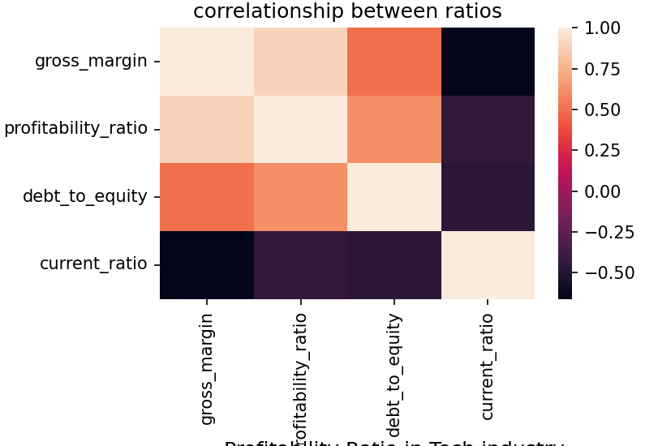
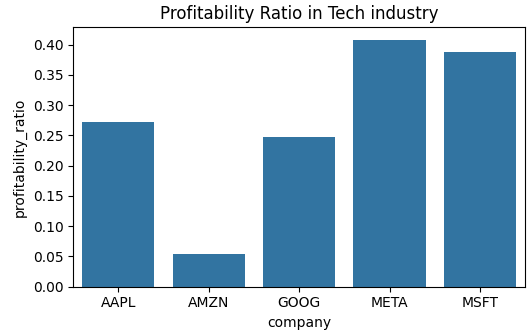
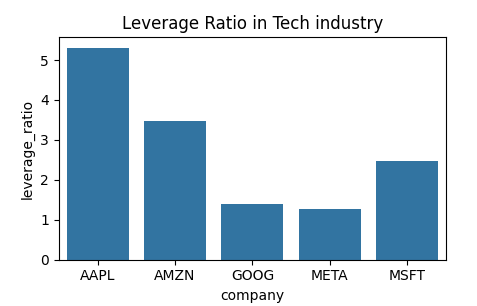

# 📊 Visualizations

### 1. Revenue Over Time by Sector

Shows the trend in operating revenue across Real Estate, Technology, and Consumer Goods.

---

### 2. Profitability vs. Debt Ratio

Scatter plot comparing profitability and leverage.

---

### 3. Correlation Matrix

Relationship between growth, profitability, and liquidity.

---

### 4. Tech Companies - Profitability

Apple, Amazon, Google, Meta, Microsoft.

---

### 5. Tech Companies - Debt Capacity

Debt-to-equity comparison across top tech firms.

